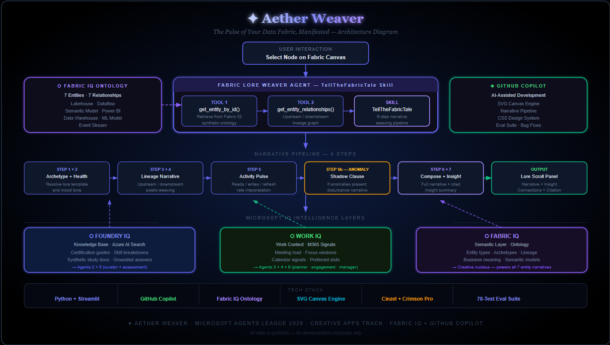

# ✦ Aether Weaver — The Pulse of Your Data Fabric, Manifested

> **Microsoft Agents League Hackathon 2026 · Creative Apps Track**
> Built entirely with GitHub Copilot · Powered by Microsoft Fabric IQ



---

## 🌌 The Idea

Enterprise data systems are living, breathing ecosystems — yet we only ever see them as dry dashboards and tables. **Aether Weaver** changes that entirely.

Aether Weaver transforms Microsoft **Fabric IQ's** semantic ontology, data lineage, and real-time events into a living artistic experience: a generative node canvas and poetic narratives that reveal the hidden soul of your data fabric.

> *"Deep within the Synthex data fabric stirs the Lakehouse of Whispering Transactions — a vast hall where structured and unstructured truths coexist, and the origin from which all knowing flows..."*

---

## 🎨 What It Does

### The Fabric Canvas
A living SVG node graph where every entity in the Fabric IQ ontology becomes a glowing crystalline node. Node colour, pulse rings, and edge particle flows reflect real-time health status and data throughput — healthy flows glow gold, warnings pulse amber, idle nodes rest in cool blue.

### The Fabric Lore Weaver Agent
The heart of the application. A multi-step AI agent that:

1. **Retrieves** entity metadata from the Fabric IQ synthetic ontology (type, lineage, activity, anomalies)
2. **Identifies** its archetype: Source of Truth, Transformer, Oracle, Deliverer, Guardian, Seer, or Pulse
3. **Weaves** a multi-paragraph poetic narrative grounded in the ontology — cited, never hallucinated
4. **Surfaces** a plain-language insight: capacity warnings, anomaly alerts, dependency flags

### Multi-Modal Visual Language
Without a single word of label text on the canvas, the system communicates:
- **Node size** → relative importance
- **Pulse rings** → health status (warning = dashed amber, idle = soft blue)
- **Edge thickness** → data throughput (extreme/high/medium/low)
- **Particle density** → flow activity
- **Selection glow** → active focus

---

## ⬡ Microsoft IQ Integration

**Fabric IQ is the creative nucleus — not an add-on:**

| Fabric IQ Capability | How Aether Weaver Uses It |
|---|---|
| **Ontology** | Entity types, archetypes, business meaning → narrative identity |
| **Data Lineage** | Upstream/downstream dependencies → visual edges + narrative lineage |
| **Semantic Models** | Business relationships and context → grounded narrative generation |
| **Real-time Events** | Activity signals, anomalies, refresh rates → visual pulse + tone |

All narrative outputs are cited: *"Fabric IQ Synthetic Ontology — Synthex Enterprise Data Fabric"*

---

## ◈ GitHub Copilot Usage

Built entirely with GitHub Copilot assistance:

- **SVG Canvas Engine** — Copilot generated the node graph rendering logic, bezier curve calculations, and gradient definitions
- **Lore Weaver Agent** — Copilot designed the multi-step skill pipeline: archetype resolution → health tone → narrative composition
- **CSS Design System** — Copilot generated the cosmic dark theme, typography system, and animation approach
- **Ontology Schema** — Copilot designed the Fabric IQ synthetic data structure
- **All development documented** — Copilot Chat used throughout for debugging, refactoring, and creative decisions

---

## 🏗️ Architecture

```
User selects node on Fabric Canvas
          ↓
  Fabric Lore Weaver Agent
          ↓
  Tool 1: get_entity_by_id()
  → Retrieves from Fabric IQ synthetic ontology
          ↓
  Tool 2: get_entity_relationships()
  → Upstream/downstream lineage
          ↓
  Skill: TellTheFabricTale
  → Step 1: Archetype identification
  → Step 2: Health mood determination
  → Step 3: Opening statement
  → Step 4: Lineage narrative
  → Step 5: Activity event interpretation
  → Step 6: Prophetic closing
          ↓
  Output: Narrative + Insight + Citation
          ↓
  Rendered in The Lore Scroll panel
```

---

## 📁 Project Structure

```
aetherweaver/
├── app.py                    # Main Streamlit application
├── mcp_server.py             # MCP Server — 4 tools for GitHub Copilot
├── eval.py                   # 78-test evaluation suite
├── copilot_usage.md          # GitHub Copilot usage documentation
├── requirements.txt
├── .gitignore
├── .streamlit/
│   └── config.toml           # Dark theme configuration
├── .vscode/
│   └── mcp.json              # VS Code MCP server configuration
├── agents/
│   ├── __init__.py
│   └── lore_weaver.py        # Fabric Lore Weaver agent + TellTheFabricTale skill
└── data/
    └── fabric_ontology.json  # Fabric IQ synthetic ontology (7 entities, 7 relationships)
```

---

## 🚀 Quick Start — Web App

```bash
git clone https://github.com/YOUR_USERNAME/aetherweaver
cd aetherweaver
python -m venv .venv
.venv\Scripts\activate   # Windows
pip install -r requirements.txt
streamlit run app.py
```

Open `http://localhost:8501`

---

## ◈ MCP Server — Use Inside GitHub Copilot

Aether Weaver ships as a fully functional MCP server. Install it in VS Code and use the Fabric Lore Weaver directly inside GitHub Copilot Agent Mode.

### Setup

**Step 1 — Install dependencies**
```bash
pip install mcp streamlit
```

**Step 2 — The `.vscode/mcp.json` is already included in the repo**
```json
{
  "servers": {
    "aether-weaver": {
      "type": "stdio",
      "command": "python",
      "args": ["${workspaceFolder}/mcp_server.py"]
    }
  }
}
```

**Step 3 — Open GitHub Copilot Chat in VS Code**
- Switch to **Agent Mode** (click the mode dropdown in Copilot Chat)
- The `aether-weaver` server will appear automatically

**Step 4 — Try these prompts in Copilot:**

```
List all entities in the Fabric IQ data fabric
```
```
Get the lore of E001
```
```
What is the health status of the entire fabric?
```
```
Show me the data lineage for E005
```

### Available MCP Tools

| Tool | What It Does |
|---|---|
| `get_entity_lore` | Weave a poetic narrative for any Fabric IQ entity |
| `list_fabric_entities` | List all 7 entities with type, archetype, health |
| `get_fabric_health` | Full fabric health report with warnings and anomalies |
| `get_entity_lineage` | Upstream/downstream lineage map with relationship types |
pip install -r requirements.txt
streamlit run app.py
```

Open `http://localhost:8501`

---

## 🎮 Demo Guide

1. Open the app — observe the living Fabric IQ canvas with 7 interconnected nodes
2. Click **✦ Weave** on any node to awaken the Lore Weaver
3. Watch the Lore Scroll panel populate with a poetic narrative
4. Notice node colour, pulse rings, and edge flows change to reflect the selected entity
5. Try **Customer_360_Warehouse** (E005) — it has active anomalies
6. Try **Inventory_Event_Stream** (E007) — extreme throughput, eternal pulse
7. Try **Churn_Prediction_Model** (E006) — dormant oracle, idle state

---

## 🔒 Responsible AI & Synthetic Data

- All data is entirely synthetic — no real company, employee, or customer data
- Entity names, metrics, and relationships are fabricated for demonstration
- All narrative outputs explicitly cited to the synthetic knowledge source
- No clinical, financial, or consequential decisions are made by the system

---

## 🏆 Hackathon Track

- **Track:** Creative Apps (GitHub Copilot)
- **IQ Layer:** Microsoft Fabric IQ (ontology, lineage, semantic models, events)
- **Built with:** GitHub Copilot throughout development
- **Challenge:** Microsoft Agents League 2026

---

*⚠️ All data is synthetic and created for demonstration purposes only.*
